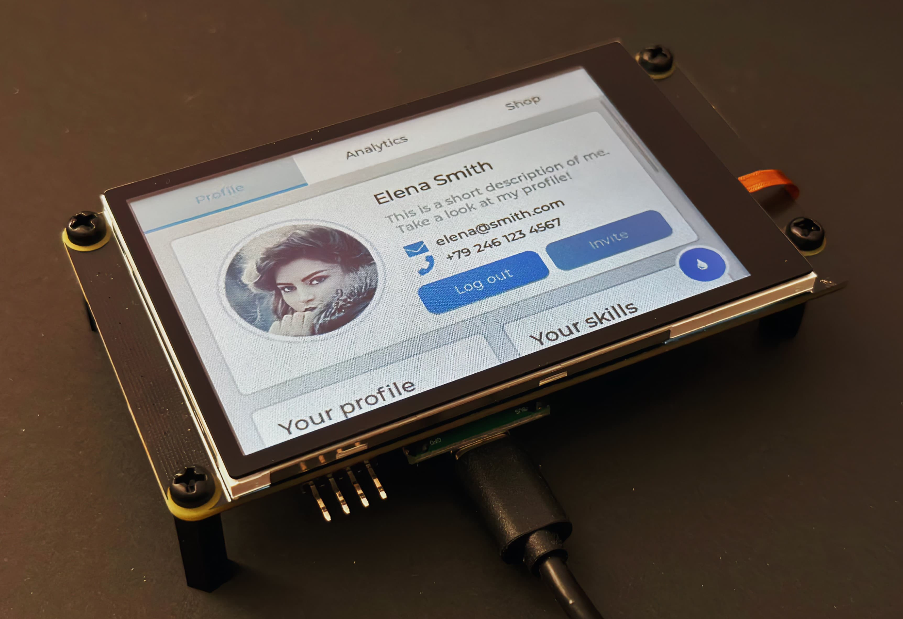

# Pico_DM_QD3503728_SCgui

这是 [SCGUI](https://gitee.com/li_yucheng/scgui)  在 Raspberry Pi Pico 上的移植项目，适配 QD3503728 3.5寸 TFT 显示屏。

SCGUI 是一个专为嵌入式系统设计的轻量级GUI框架，针对资源受限环境进行了优化，只需要 1-3k 内存即可运行。

## SCGUI 特性

### 核心特性
- 高效的脏矩形管理机制，减少不必要的屏幕刷新
- 分帧缓冲(PFB)渲染，支持大尺寸显示器的内存优化
- 优化的绘图功能，包括抗锯齿线条绘制
- 灵活的对齐和布局系统
- 跨编译器支持，兼容多种嵌入式开发环境
- 完整的颜色系统，提供丰富的预定义颜色

### 性能优化
**内存使用优化**
- 分帧缓冲减少内存占用，可配置的缓冲区大小
- 内存高效的分片渲染机制，支持双缓冲DMA传输

**渲染优化**
- 脏矩形缓冲池：默认8个，可根据需要调整
- 动态合并阈值：根据使用情况自动调整，使用静态数组实现高效的脏区域追踪
- 智能合并算法，优化渲染性能，支持动态阈值调整，防止全屏绘制，脏区域精确更新
- DMA硬件加速支持

**计算优化**
- 查表法三角函数
- 优化的Alpha混合
- 优化的旋转算法，支持任意角度抗锯齿旋转，支持图片与文本旋转缩放

### 绘图引擎
- 常用图形绘制函数都支持Alpha混合抗锯齿
- 抗锯齿线条绘制
- 圆角矩形绘制
- 圆弧绘制，任意角度圆弧，支持渐变
- 图像绘制，支持压缩或透明度，支持旋转缩放
- 动画绘制，支持帧动画压缩一键生成
- 文本兼容lvgl字库，Unicode编码，一键生成
- 文本扩展，流动文字，旋转缩放，带光标编辑文本框，支持长文本自动换行，数值显示，间距调节

### 支持的控件
支持自定义控件组合，由基础控件组合成复杂控件：
- 进度条
- 滑动条
- 按钮控件
- 消息框
- 菜单控件
- 列表控件
- 表格控件
- 图表控件

### 布局系统
- 支持水平布局
- 支持垂直布局
- 支持对齐方式

### Technical specifications
| Part        | Model                       |
| ----------- | --------------------------- |
| Core Board  | Rasberrypi Pico             |
| Display     | 3.5' 480x320 ILI9488 no IPS |
|             | 16-bit 8080 50MHz           |
| TouchScreen | 3.5' FT6236 capacity touch  |

### Pinout

| Left    | Right  |
| ------- | ------ |
| GP0/DB0 | VBUS   |
| GP1/DB1 | VSYS   |
| GND     | GND    |
| GP2/DB2 | 3V3_EN |
| ...     | ...    |

#### ILI9488 Display pins

- GP0 ~ GP15 -> ILI9488 DB0-DB15 16 pins

- GP18 -> ILI9488 CS (Chip select)

- GP19 -> ILI9488 WR (write signal)

- GP20 -> ILI9488 RS (Register select, Active Low, 0: cmd, 1: data)

- GP22 -> ILI9488 Reset (Active Low)

- GP28 -> IlI9488 Backlight (Active High)

#### FT6236 Touch pins

- GP18 -> FT6236 Reset (Active Low)
  
- GP21 -> FT6236 IRQ (Active Low, 100Hz sample rate)
  
- GP26 -> FT6236 SDA (I2C1_SDA)
  
- GP27 -> FT6236 SCL (I2C1_SCL)

